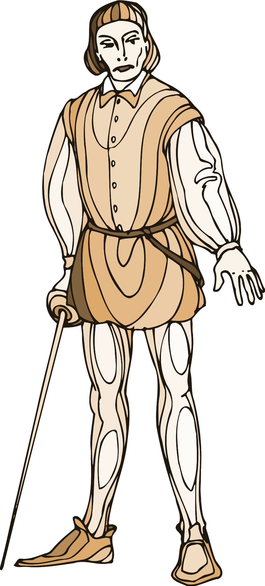
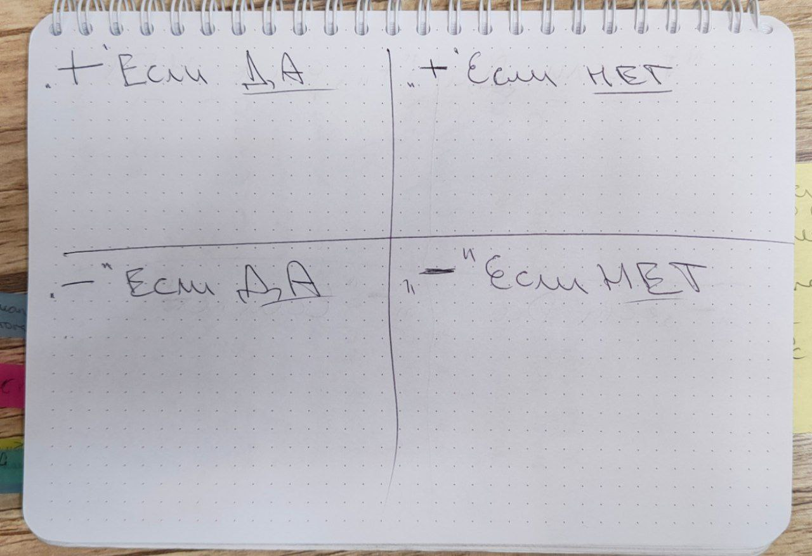
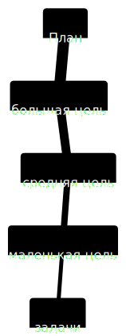
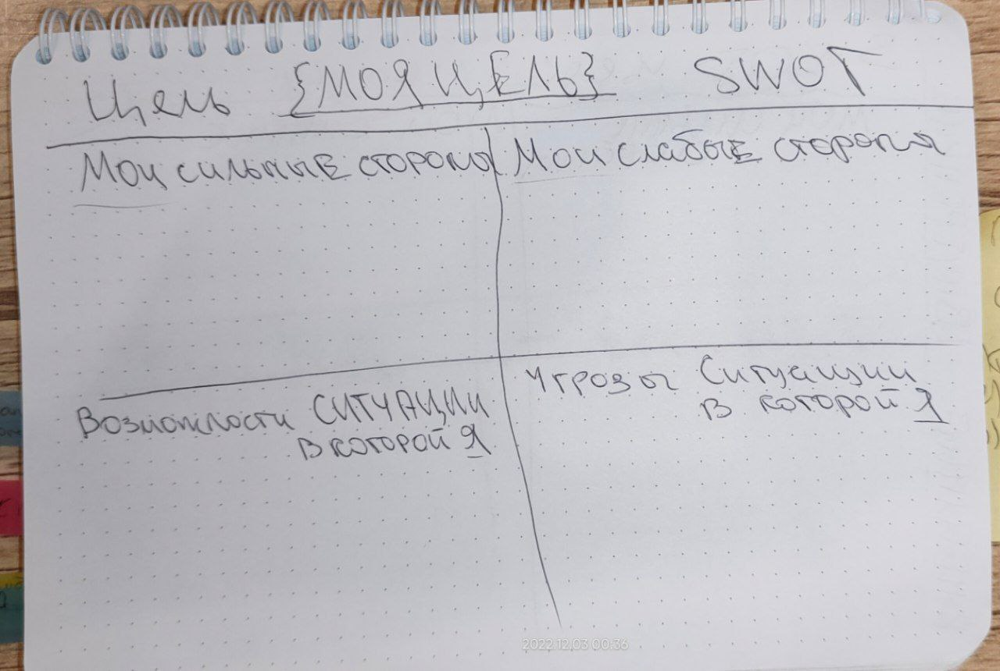
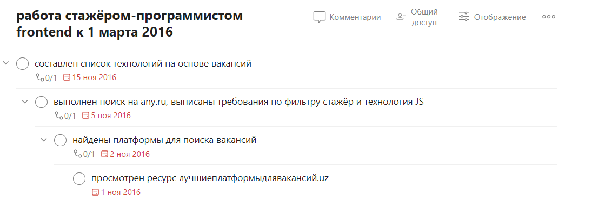
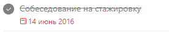
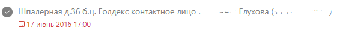

<!-- _class: cover -->
# Три инструмента войтиайтишника-студента
### что действительно работает на личном опыте

<!-- 
цель доклада: студент должен пойти и начать делать:
1. оценку принимаемых им решений по методу квадрата Декарта
2. составить план с использованием SMART
3. начать реализовывать план, оценивая свои реальные возможности и трекая прогресс
 -->

## Щербаков Алексей
Тимлид в IT компании, разрабатывающей ПО для отрасли телеком

* 7 лет в коммерческой разработке
* 5 команд
* 7 продуктов
* 5 ролей
    * автоматизатор тестирования
    * ручной тестировщик
    * разработчик
    * тимлид
    * наставник
* ❤ 🍷 🏄‍♂️ 🍻 👩‍💻

🙏 [telegramm](https://t.me/alexey_shcherbakov) | [linkedin](https://www.linkedin.com/in/shcherbakov/) | [GitHub](https://github.com/akaguny)

<!-- 
последние 7 лет я занимаюсь разработкой ПО
за это время удалось поработать в 5 командах
над 7 продуктами в различных ролях.
с гордостью могу сказать что побывал в ролях
тестировщика ручного и автоматизатора
разработчика, тимлида и наставника
 -->

## Как я пришёл к работе в IT

* 1999 идея стать программистом
<!-- в шесть захотел стать программистом как моя тётя -->
* 2005-2016 школа, Университет аэрокосмического приборостроения (ГУАП), специализация управление в технических системах, подработки 
* 2015 отчисление, отставание на 1 курс
* 2016 последний курс университета. Кризис "бывалого" студента
 ## Кризис "бывалого" студента
 * подходит окончание университета
 * специализация - не то, чем хочу заниматься всю жизнь
 * подработки не вырастут в карьеру
 * есть желание стать программистом
 * непонятно какие шаги предпринять

 <!-- 
 возможно у кого-то из вас откликается моя история.
 и вы также как я имеете желание,
 но не имея профильного опыта не знаете что делать дальше.
  -->

## ❓ Вопрос ❓
### Быть или не быть?

### поднимите левую руку ✋ если сталкивались

## Что помогло мне

### 3 инструмента
1) Квадрат Декарта
2) Постановка целей по S.M.A.R.T
3) Тайм-менеджмент

## ❓ Вопрос ❓
### Оценивали ли плюсы и минусы решений при принятии?
#### поднимите руку ✋если оцениваете плюсы и минусы решений
<!-- 
отлично!
образовалось 2 группы
Для вопрошаюших - вы большие молодцы, дальше я расскажу как делать это эффективно и масштабируемо
Для тех, кто не подвергает решения критике - у вас есть шанс сразу начать это делать правильно. Но начинать определённо стоит.
 -->
 ## Квадрат Декарта как инструмент для оценки решений.
 > "Я думаю, значит, я есть" Декарт
 ### Квадрат Декарта предлагает ответить на вопросы:

1) Что будет, если это произойдет?
2) Что будет, если этого НЕ произойдет?
3) Что НЕ будет, если это произойдет?
4) Чего НЕ будет, если это НЕ произойдет?

<!--
Пока звучит сложно, не так ли?
Попробуем применить, должно стать понятнее.
-->
<!--
_footer: "[статья с хорошими иллюстрациями на тему квадрата Декарта](https://goal-life.com/page/method/kvadrat-dekarta)"
-->
## ❓ Вопрос ❓
### Есть ли у вас ручка, бумага (3 листа) и какое-нибудь спорное решение?

### поднимите руку ✋ если да и приготовьте инвентарь
## ❕ Практика ❕. Квадрат Декарта
1) сформулируйте решение, которое надо принять
2) 
<!-- 
Я поделюсь с вами своим опытом, а вы попробуете его на себе
 -->
## Квадрат Декарта. Что, если принять решение стать программистом?

<table><tbody><tr><td colspan="3">➕, если становиться программистом</td><td></td><td colspan="3">➕, если НЕ становиться программистом</td></tr><tr><td>№</td><td>вес</td><td>факт</td><td></td><td>№</td><td>вес</td><td>факт</td></tr><tr><td>1</td><td>5</td><td>большая зарплата</td><td></td><td>1</td><td>5</td><td>делаю что умею</td></tr><tr><td>2</td><td>3</td><td>перспективно </td><td></td><td>2</td><td></td><td></td></tr><tr><td>3</td><td>3</td><td>мечта детства сбудется</td><td></td><td>3</td><td></td><td></td></tr><tr><td>Σ</td><td>11</td><td></td><td></td><td>Σ</td><td>5</td><td></td></tr><tr><td colspan="3">➖, если становиться программистом</td><td></td><td colspan="3">➖, если НЕ становиться программистом</td></tr><tr><td>№</td><td>вес</td><td>факт</td><td></td><td>№</td><td>вес</td><td>факт</td></tr><tr><td>1</td><td>4</td><td>не знаю как</td><td></td><td>1</td><td>4</td><td>упрусь в потолок</td></tr><tr><td>2</td><td>5</td><td>нет времени</td><td></td><td>2</td><td>5</td><td>заниматься "инфорцыганщиной"</td></tr><tr><td>3</td><td>2</td><td>учиться</td><td></td><td>3</td><td>3</td><td>поиски себя</td></tr><tr><td>Σ</td><td>11</td><td></td><td></td><td>Σ</td><td>12</td><td></td></tr></tbody></table>

<!-- 
Можно заметить, что у меня присутствуют какие-то веса.
Это то, на сколько значимый факт для вас лично.
Поэтому я попрошу и вас проставить значимость по шкале от 1 до 5
Где 1 - незначительное событие, а 5 критически важное
 -->

 ## Квадрат Декарта. Анализ результатов
1) ➕, если становиться программистом - значимость **11**
2) ➕, если НЕ становиться программистом - значимость **5**
3) ➖, если становиться программистом - значимость **11**
4) ➖, если НЕ становиться программистом - значимость **12**

1) Решение становиться программистом имеет большую силу чем не делать этого.  11 против 5 пунктов
2) Решение становиться программистом имеет примерно столько-же негативных последствий, как и не делать этого.  **11** и **12** пунктов

 ## Квадрат Декарта. Выводы
1) Решение стать программистом разумно. Принято 🏆
2) С негативными фактами необходимо будет разобраться 🎯

## ❓ Вопрос ❓
### Получили инсайд по принятию решения, удалось ли выполнить упражнение?
### поднимите правую руку ✋ если да

<!-- 
Отлично, с первым инструментом разобрались!
 -->
## Инструменты. Планирование

1) совокупность целей - план
2) цель должна быть сформулирована таким образом, чтобы было удобно её выполнять
3) для правильной формулировки есть инструмент! S.M.A.R.T

<!-- 
План это совокупность долгосрочных, среднесрочных, краткосрочных целей и конкретных шагов.
Плохая новость в том, что хорошо  формулировать цели не просто
Но хорошая в том, что для этого уже есть инструмент
 -->

## Инструменты. Постановка целей
### Что такое S.M.A.R.T.?
* **S**pecific(конкретный)
* **M**easurable(измеримый)
* **A**chievable(достижимый)
* **R**elevant(значимый)
* **T**ime bound(ограниченный по времени)

## ❓ Вопрос ❓
### подходит ли "стать программистом" в качестве цели?
### поднимите правую руку ✋ если да
## ❕ Практика ❕. S.M.A.R.T
1) Возьмите любую вашу цель
2) Запишите на бумаге

## Инструменты. S.M.A.R.T.
### Мой опыт
> формулировка: стать программистом
1) ❌ Specific (конкретный) - как быть программистом
2) ❌ Measurable (измеримый) - нет критерия достижения
3) ❌ Achievable (достижимый) - возможно ли это в принципе
4) ✅ Relevant (значимый) - квадрат Декарта одобряет
5) ❌ Time bound (ограниченный по времени) - нет сроков достижения

## S.M.A.R.T.
### Specific(конкретный).M.A.R.T.
* ❌ стать программистом
* ✅ устроиться на работу
## S.M.A.R.T.
### S.Measurable(измеримый).A.R.T.
* ❌ устроиться на работу
* ✅ устроиться на работу инженером программистом
## S.M.A.R.T.
### S.M.A.R.Time bound(ограниченный по времени)
* ❌ устроиться на работу инженером программистом
* ✅ устроиться на работу инженером программистом к 1 марта 2016
<!-- 
Но где критерий Достижимый?
Вкусное оставим на потом и разберёмся с ограничением по времени.
 -->
## S.M.A.R.T.
## S.M.Achievable(достижимый).R.T.
### SWOT анализ достижимости цели
|||
|---|---|
|1. сильные стороны|2. слабые стороны|
|....|....|
|....|....|
|3. возможности|4. угрозы|
|....|....|
|....|....|

## ❕ Практика ❕. SWOT

## Инструменты. SWOT анализ
### Что получилось у меня. Цель: "устроиться на работу инженером программистом к 1 марта 2016"

||| 
|---|---|
|😏сильные стороны|😥 слабые стороны|
|умею работать с ПК|знания|
|технарь|опыт|
|🤗 возможности|🎃 угрозы|
||учёба отнимает много времени|
||нет источников денег|

1) угрозы -> возможности
2) сильные стороны -> возможности
3) слабые стороны -> конкретизировать

<!-- 
Это пример простого SWOT анализа. т.е. анализа возможностей и угроз.
Задача уменьшить угрозы и в идеале превратить их в возможности.
 -->
## Инструменты. SWOT анализ
### слабые стороны
* ❌ знания
* ✅ нет базовых знаний javascript (JS)
* ❌ опыт
* ✅ нет опыта разработки на JS

 <!-- 
 я когда-то вставлял js на разрабатываемые сайты и даже правил с
  -->
## Инструменты. SWOT анализ
### Как повлияла работа по сужению слабых сторон на цель?
* ❌ устроиться на работу инженером программистом к 1 марта 2016
* ✅ устроиться на работу **инженером-стажёром frontend** к 1 марта 2016

## Инструменты. SWOT анализ
### 🎃 угрозы `+` 😏 сильные стороны `=` возможности
* 🎃 учёба отнимает много времени
* 🤗 выполнить дипломный проект на javascript.
* взять цель "выполнить дипломный проект с использованием javascript к 25 мая 2016"
* 🤗 вести работу в git
* 🤗 качать софт скиллы на помощи сокурсникам
* 🎃 нет источников денег 
* 🤗 делать курсовые не одноразово, а использовать Mathcad. Продавать 🤑

## Инструменты. SWOT анализ
### Как преобразился
||| 
|---|---|
|😏сильные стороны|😥 слабые стороны|
|умею работать с ПК|нет базовых знаний JS|
|технарь|нет опыта разработки на JS|
|🤗 возможности|🎃 угрозы|
|выполнить дипломный проект на javascript|время ограничено|
|вести работу в git||
|делать курсовые не одноразово, а использовать Mathcad. Продавать||

## S.M.A.R.T.
### S.M.Achievable(достижимый).R.T. SWOT анализ, что в результате?
* цель достижима!
* все критерии S.M.A.R.T удовлетворены!

## ❓ Вопрос ❓
### Получилось ли у вас сформулировать цель по S.M.A.R.T?
### поднимите левую руку ✋ если да
## Инструменты. План.
### Какой план получился у меня
| большая                                                             | средняя цель                                               | маленькие цели                                                                         | задачи и подзадачи |
|---------------------------------------------------------------------|------------------------------------------------------------|----------------------------------------------------------------------------------------|--------------------|
| устроиться на работу стажёром-программистом frontend к 1 марта 2016 | составлен список технологий на основе вакансий к 15 ноября | выполнен поиск на `any.ru`, выписаны требования по фильтру стажёр и технология JS к... | ...                |
| выполнен дипломный проект с использованием javascript к 25 мая 2016 | придуман дипломный проект на JS к 1 ноября                 | ...                                                                                    | ...                |
|                                                                     | дипломный проект согласован к 15 ноября                    | ...                                                                                    | ...                |
|                                                                     | план выполнения дипломного проекта к 30 ноября             | ...                                                                                    | ...                |
| ...                                                                 | ...                                                        | ...                                                                                    | ...                |
<!-- 
считаю что получилось не дурно
троеточками (...) в примере отображена необходимость расширения и детализации.
но общий принципе я считаю удалось отразить
 -->
## Инструменты. План 
### Задание на дом: используя инструменты подготовить план на основе своей цели 😁

  1) долгосрочные цели (год - 5 лет)
  2) среднесрочные
  3) краткосрочные
  4) маленькие - конкретные шаги
## Инструменты. План
### Что после того как план готов?
1) контролировать сроки
2) дополнять
3) детализировать

* Важно: всё это делать нужно регулярно как зарядку!

## Вопрос: кто из вас пользуется напоминаниями?
### поднимите правую руку ✋если пользуетесь
<!-- 
Да, действительно "напоминалки" крайне полезны.
Плохая новость в том, что:
Человек существо ленивое, нам нужны "напоминалки", сигналы к действию.
Также нам не потерять мотивацию, для чего нужны маленькие победы, за которые нас похвалят.
Кроме того как говорилось ранее план нужно детализировать и актулизировать. Считаю что на бумаге это будет очень сложно и не продуктивно.
Но есть и хорошая: человечество давно борется с этой проблемой, начиная от будильника и заканчивая таск трекерами и инструментами тайм-менеджмента.
О последнем и поговорим дальше.
 -->

## Инструменты. Таск-трекинг
Требования:
* оформление задач как целей по S.M.A.R.T.
  * описание
  * срок выполнения
* объединение задач для выполнения целей - каталогизация
* напоминание о сроках, предстоящих задачах - нотификации
* отчётность - дополнительная мотивация и отслеживание прогресса

<!-- 
Работа с планом - сложная.

Нужна помогалочка - Таск-трекинг.
Помним про SMART, а значит у задач обязательно должны быть сроки
Необходимо чтобы было понятно к какой цели нас приблежает выполнение задачи, значит необходима каталогизация задач
Также как вы верно отметили напоминания удобны и они нам тоже нужны
Чтобы не терять фокус и мотивацию желательно также иметь возможность отчётности за период и по целям, которые обозначены в плане
 -->
## Инструменты. Таск-трекинг
* ### Todoist - очень крутой и мощный таск-менеджер. А главное - обширные возможности в бесплатном тарифе.
* ### План -> Todoist
## Инструменты. Таск-трекинг
### Todoist - очень крутой и мощный таск-менеджер. А главное - обширные возможности в бесплатном тарифе.
### План -> Todoist

| сущность плана   | сущность todoist |
|------------------|------------------|
| большая цель     | проект           |
| средняя цель     | задача 1 уровня  |
| маленькая цель   | задача 2 уровня  |
| задачи подзадачи | задача 3 уровня  |

## Инструменты. Таск-трекинг
### Как выглядит Todoist для моего плана

## Инструменты. Тайм-менеджмент

* планирование день/неделя/месяц/год
* отслеживать комфортное количество задач
* фокус на выполнении задач
<!-- 
планирование - с этим уже разобрались, идём дальше
понимание ёмкости - с этим немного сложнее. Как отправную точку можно взять свой предыдущий месяц и выписать туда все значимые активности, которые можно вспомнить.
И начать фиксировать с настоящего момента. С этим нам как раз поможет таск-трекер. Можно например создать проект прочее и начать туда заносить все активности.
фокус на выполнении задач. Тут ещё сложнее, про это и пойдёт речь дальше.
 -->
## Вопрос: кто из вас слышал про 🍅🍅🍅 технику?

### поднимите руку ✋если слышали
## Инструменты. Pomodoro timer - фокус на выполнении задач
### 🍅 + 🐟 = 👨‍🔬

## Выводы
вся цепочка состоит из использования инструментов
1) принятие решения
2) составление плана с простановкой целей
3) использование таск-трекера
4) использование техники фокусировки внимания
5) регулярность действий

## Как я пришёл к работе в IT. Продолжение

* 2016 принял решение > поставил цель > составил план > закончил университет > получил работу

* 
* 

## Вывод
### Сегодня мы узнали как и что делать:
* не нужно:
  * опускать руки
  * хвататься за всё подряд.
* нужно:
  * оценивать свои силы
  * принимать взвешенные решения
  * строить планы и их достигать
* что поможет в удержании фокуса

## Полезные ссылки
Вместо листа бумаги:
- [шаблон квадрат Декарта](https://docs.google.com/spreadsheets/d/1o2SvlzFEloy3kLtuyszf6XegmDG4xH_QmT_sRSBCV98/edit?usp=sharing)

Программные продукты:
- [таск-трекер](https://todoist.com/)
- [pomoodoro timer](https://pomodorotimer.online/)

Инструменты, используемые в подготовке доклада:
- [marpit](https://marp.app/) - slides as code
- [улучшенная методика принятия решений](https://tqm.com.ua/likbez/article/kvadrat-dekarta-prinyatie-resheniy)
- [tablesgenerator](https://www.tablesgenerator.com/html_tables#) - WYSIWG редактор таблиц с импортом в makdown, html...
- [vscode](https://code.visualstudio.com/)

## Спасибо за помощь в подготовке доклада!
- прогоны
  - Кульбякина, Таня (повествование)
  - Сергиевский Дима (оформление и анимированные списки)
  - Тарасова Оля (интерактив с листком и ручкой)
- branshtorm целей, идей и тем доклада
  - Бобомурод Тошбоев
  - Мухаммад
  - Руслан Шарифуллин
  - Дмитрий Савинов
## Спасибо за внимание и феноменальную активность!
### Вопросы?

https://t.me/+jrZQ-2ZhYIVlODli